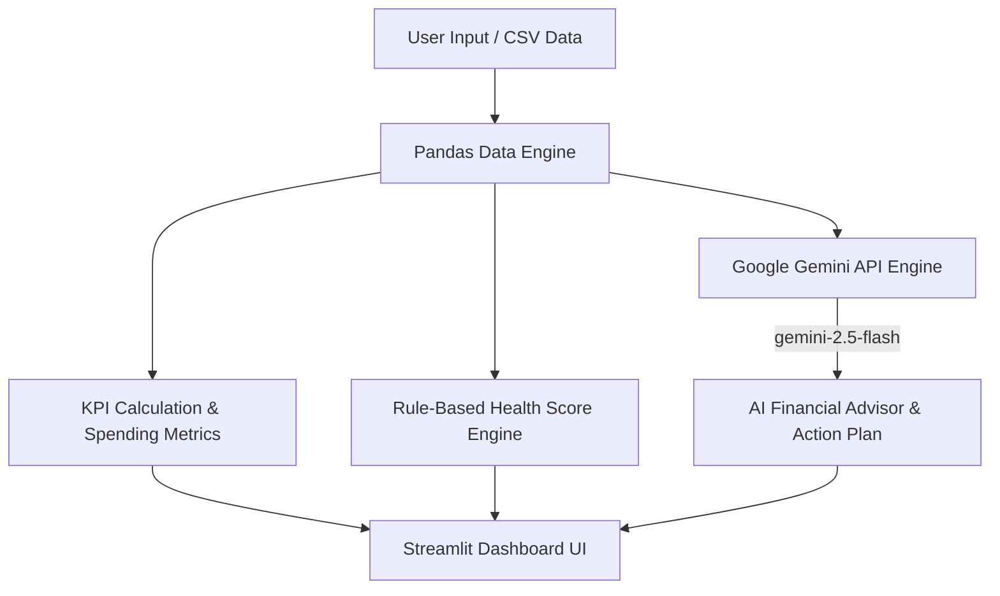

Here is a breakdown of what **Mermaid diagrams** are, followed by your complete, copy-paste ready **Terminal-Style `README.md**` complete with an embedded Mermaid architecture diagram.

---

### 💡 What is Mermaid?

**Mermaid** is a Markdown-native syntax that turns text definitions into visual diagrams directly inside GitHub or Gitlab `.md` files. Instead of drawing an image, taking a screenshot, and uploading it, you write simple text inside a ```mermaid codeblock, and GitHub automatically renders it as a clean flow diagram, architecture chart, or sequence map.

In the README below, a Mermaid flow diagram has been included under the **SYSTEM ARCHITECTURE** section to visualize how data flows from your user input to Pandas and the Gemini API.

---

### 💻 Complete Terminal-Style `README.md`

Copy and paste the code block below directly into your project's `README.md` file:

```markdown

```

______     __                   *ption
/ _*/ /* __/ /  _______ _____ (*)___  ___  ___
*\ / _ / // / _ / __/ __/ / _ / / / -*) _ 

/***/*//*_,*/*.__/_*/*/ /*/*//*/*/*/_*/_**/
/ _ |** ***/ /* / /**  ____
/ __ / // / _  / // / __/ _ / __/
/*/ /*_,*/_,*/_,*/_*/___/*/   v1.0.0

```

> **SYSTEM STATUS:** `[ONLINE]` — Financial Audit & Subscription Telemetry Dashboard  
> **ENGINE:** Python 3.x | Streamlit UI | Google Gemini API (`gemini-2.5-flash`)

---

## 🖥️ $ sys_info --overview

The **Subscription Auditor** is a terminal-inspired, dark-themed dashboard built with **Streamlit** to analyze, track, and optimize recurring digital expenses. It integrates rule-based heuristic scoring with real-time AI intelligence via the `google-genai` SDK.


```

[+] TELEMETRY Breakdown: Real-time Monthly & Annual KPI Tracking
[+] HEALTH DIAGNOSTICS: Automated leakage detection & budget threshold scoring
[+] DATA MATRIX EDITOR: In-app live manipulation of target subscription records
[+] I/O PIPELINE     : CSV state import / export workflow engine
[+] SAVINGS SIMULATOR: Real-time slider-driven discretionary spending modeling
[+] GEMINI AI ENGINE : Autonomous 30-day action plan & optimization advisor

```

---

## 📐 $ cat architecture.mmd



---

## 🖼️ $ display --gallery

---

## ⚡ $ ./quickstart.sh

### Step 1: Clone Repository

```bash
git clone https://github.com/your-username/subscription-auditor.git
cd subscription-auditor

```

### Step 2: Initialize Virtual Environment

```bash
# Linux / macOS
python3 -m venv venv
source venv/bin/activate

# Windows (PowerShell / CMD)
python -m venv venv
.\venv\Scripts\activate

```

### Step 3: Install Required Dependencies

```bash
pip install streamlit pandas google-genai python-dotenv

```

### Step 4: Provision Environment Variables

Construct a `.env` file in the root environment directory:

```env
GEMINI_API_KEY="your_gemini_api_key_here"

```

*(Note: For Streamlit Community Cloud deployments, store `GEMINI_API_KEY` in `.streamlit/secrets.toml`)*

### Step 5: Execute Dashboard Entrypoint

```bash
streamlit run app.py

```

---

## 📊 $ cat csv_schema.json

When importing custom datasets, verify the payload structure adheres to the following layout:

| Field Name | Type | Description |
| --- | --- | --- |
| `Service` | `string` | Target service identifier (e.g., *Netflix*, *Spotify*) |
| `Monthly Cost` | `float` | Monthly billing rate in numeric format (e.g., `499.0`) |
| `Category` | `enum` | Classification: *Entertainment, Music, Productivity, AI, Cloud Storage, News, Gaming, Education, Shopping, Other* |
| `Essential` | `bool` | Spending tier: `TRUE` (Essential) | `FALSE` (Discretionary) |

---

## ⚙️ $ tech_stack --list

```
[FRAMEWORK]  :: Streamlit
[DATA LAB]   :: Pandas
[INTELLIGENCE]:: Google Gemini API (gemini-2.5-flash via google-genai)
[CONFIG]     :: python-dotenv

```

---

## 📄 $ cat LICENSE

Distributed under the **MIT License**. Free for personal modification, educational analysis, and distribution.

```

```
