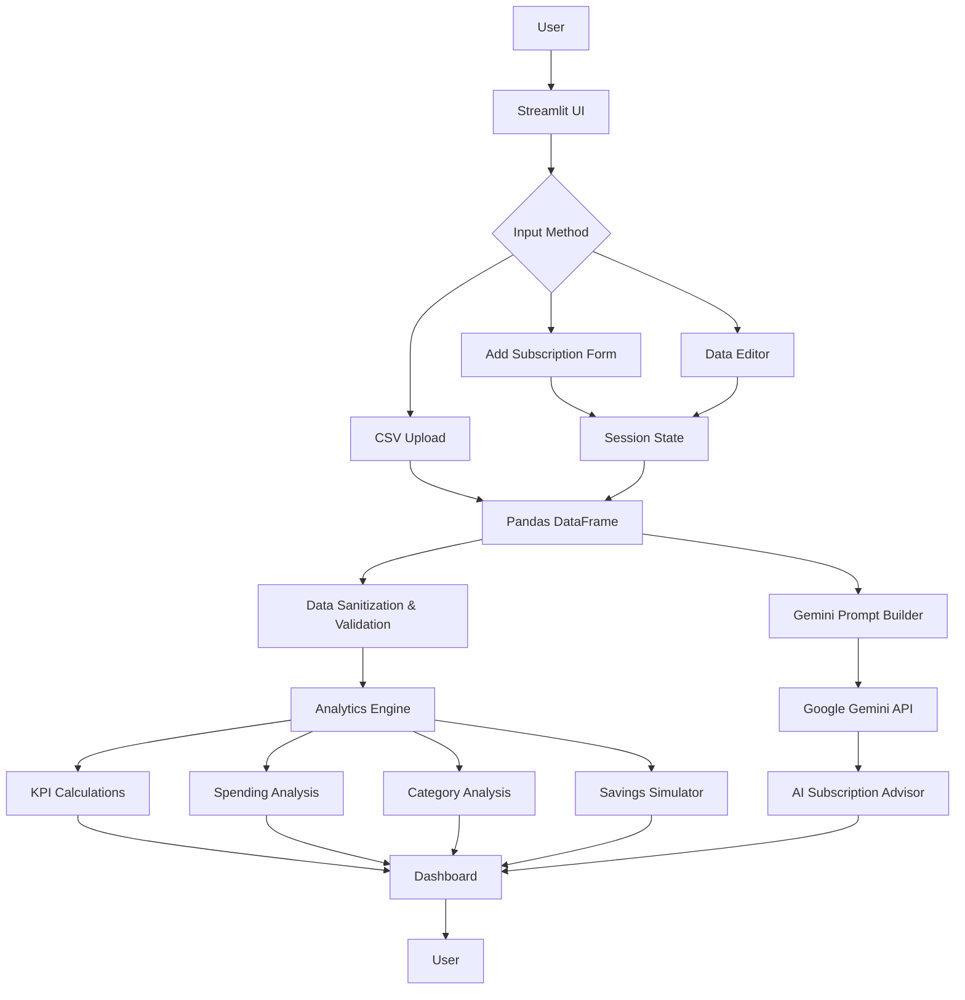

```text
╔══════════════════════════════════════════════════════════════════════╗
║                                                                      ║
║                  SUBSCRIPTION AUDITOR v1.0                          ║
║                                                                      ║
║              PERSONAL RECURRING-SPENDING ANALYTICS                  ║
║                                                                      ║
╚══════════════════════════════════════════════════════════════════════╝
````

### `> Track. Analyze. Optimize.`

A Streamlit + Gemini AI dashboard for analyzing recurring digital
subscriptions, visualizing spending patterns, and identifying
potential savings opportunities.

<br>

[](#)
[](#)
[](#)
[](#)
[](#)

<br>

---

## `01 // PROJECT OVERVIEW`

```text
┌─────────────────────────────────────────────────────────────────────┐
│  SUBSCRIPTION AUDITOR                                               │
├─────────────────────────────────────────────────────────────────────┤
│                                                                     │
│  INPUT                                                             │
│    └── Subscription data                                            │
│                                                                     │
│  PROCESS                                                            │
│    ├── Pandas data processing                                       │
│    ├── Spending calculations                                        │
│    ├── Category analysis                                            │
│    ├── Savings simulation                                           │
│    └── Gemini AI analysis                                           │
│                                                                     │
│  OUTPUT                                                            │
│    ├── Financial KPIs                                               │
│    ├── Interactive tables                                           │
│    ├── Spending visualizations                                      │
│    ├── Savings projections                                          │
│    └── AI-powered recommendations                                   │
│                                                                     │
└─────────────────────────────────────────────────────────────────────┘
```
## PROJECT SCREENSHOTS


**Subscription Auditor** is an interactive financial dashboard built with
**Streamlit, Python, Pandas, and Google's Gemini API**.

The application allows users to record recurring subscriptions and
analyze their monthly and annual spending.

It calculates spending metrics, visualizes expenses by subscription and
category, separates essential and discretionary spending, provides an
interactive savings simulator, and uses Gemini AI to generate a
personalized subscription analysis.

The project was designed as a practical demonstration of:

* Streamlit application development
* Python data processing
* Pandas DataFrames
* Session-state management
* Interactive UI components
* Data visualization
* Form-based input
* Gemini API integration
* Prompt engineering
* Environment-based API configuration

---

# `02 // CORE FEATURES`

### `> SUBSCRIPTION MANAGEMENT`

* Add recurring subscriptions
* Specify monthly cost
* Assign spending categories
* Mark subscriptions as essential or discretionary
* Edit subscription information using `st.data_editor`
* Clear subscription data
* Restore demo data
* Import subscription data from CSV
* Export subscription data to CSV

### `> FINANCIAL ANALYTICS`

The dashboard automatically calculates:

```text
Monthly Spending
        ↓
Annual Spending
        ↓
Active Subscription Count
        ↓
Potential Annual Savings
        ↓
Essential / Discretionary Breakdown
```

Additional analytical indicators include:

* Highest-cost subscription
* Largest spending category
* Average subscription cost
* Discretionary spending percentage
* Subscription health indicator

### `> DATA VISUALIZATION`

The Analytics dashboard provides visual representations of:

* Annual spending by subscription
* Annual spending by category
* Essential vs non-essential annual spending
* Detailed spending breakdown

### `> SAVINGS SIMULATOR`

Users can adjust a hypothetical reduction percentage and instantly
see:

```text
CURRENT ANNUAL COST
        ↓
REDUCTION TARGET
        ↓
PROJECTED ANNUAL COST
        ↓
ESTIMATED ANNUAL SAVINGS
```

### `> GEMINI AI ADVISOR`

The application integrates Google's Gemini API to provide an
AI-powered subscription audit.

Gemini receives dynamically generated context based on the user's
subscription data and evaluates:

* Spending patterns
* Expensive subscriptions
* Discretionary expenses
* Potential spending leaks
* Possible savings opportunities
* Suggested actions

The AI analysis is triggered only when the user explicitly requests it,
preventing unnecessary API calls during normal Streamlit reruns.

---

# `03 // SYSTEM ARCHITECTURE`

## `> HIGH-LEVEL DATA FLOW`



---

# `04 // APPLICATION ARCHITECTURE`

The application follows a lightweight modular architecture inside a
single Streamlit Python application.

```text
                         ┌─────────────────────┐
                         │        USER         │
                         └──────────┬──────────┘
                                    │
                                    ▼
                         ┌─────────────────────┐
                         │   STREAMLIT UI      │
                         │                     │
                         │ Overview            │
                         │ Subscriptions      │
                         │ Analytics           │
                         │ AI Advisor          │
                         └──────────┬──────────┘
                                    │
                                    ▼
                         ┌─────────────────────┐
                         │   SESSION STATE     │
                         │                     │
                         │ subscriptions      │
                         │ AI analysis         │
                         │ UI state            │
                         └──────────┬──────────┘
                                    │
                                    ▼
                         ┌─────────────────────┐
                         │   PANDAS DATAFRAME  │
                         │                     │
                         │ Validation          │
                         │ Sanitization        │
                         │ Calculations        │
                         └───────┬─────┬───────┘
                                 │     │
                    ┌────────────┘     └─────────────┐
                    ▼                                ▼
          ┌──────────────────┐              ┌──────────────────┐
          │ ANALYTICS ENGINE │              │ GEMINI PIPELINE  │
          ├──────────────────┤              ├──────────────────┤
          │ KPIs             │              │ System Prompt    │
          │ Categories       │              │ Dynamic Context │
          │ Spending         │              │ Gemini API       │
          │ Savings          │              │ AI Response      │
          └────────┬─────────┘              └────────┬─────────┘
                   │                                 │
                   └──────────────┬──────────────────┘
                                  ▼
                         ┌─────────────────────┐
                         │    DASHBOARD        │
                         │                     │
                         │ Metrics             │
                         │ Charts              │
                         │ Tables              │
                         │ Savings             │
                         │ AI Recommendations  │
                         └─────────────────────┘
```

---

# `05 // LOGIC MODULES`

Although the application is contained in a single `app.py`, its logic is
organized into functional modules.

### `DATA LAYER`

Responsible for:

* Creating subscription DataFrames
* Cleaning incoming data
* Validating numeric values
* Handling missing values
* Maintaining consistent DataFrame columns

### `STATE MANAGEMENT`

Streamlit's `st.session_state` is used to preserve:

```text
subscriptions
AI analysis
```

This prevents application reruns from unnecessarily destroying user
data or previously generated AI results.

### `ANALYTICS LAYER`

Calculates:

* Monthly total
* Annual total
* Number of subscriptions
* Essential spending
* Discretionary spending
* Category totals
* Subscription percentages
* Potential savings

### `VISUALIZATION LAYER`

Converts processed Pandas data into dashboard visualizations and KPI
components.

### `AI LAYER`

The Gemini integration consists of:

```text
Subscription Data
       ↓
Dynamic Context Generation
       ↓
System Instruction
       ↓
Gemini API Request
       ↓
AI Analysis
       ↓
Streamlit UI
```

The Gemini request is only executed when the user presses the analysis
button.

---

# `06 // GEMINI AI INTEGRATION`

## `> PROMPT ENGINEERING PIPELINE`

The application does not use Gemini as a generic chatbot.

Instead, the user's subscription data is converted into structured
context before being sent to the model.

```text
User Subscription Data
          │
          ▼
┌───────────────────────────┐
│ Calculate Financial Stats │
└─────────────┬─────────────┘
              │
              ▼
┌───────────────────────────┐
│ Build Dynamic AI Context  │
└─────────────┬─────────────┘
              │
              ▼
┌───────────────────────────┐
│ Apply System Instruction  │
└─────────────┬─────────────┘
              │
              ▼
┌───────────────────────────┐
│      Google Gemini        │
└─────────────┬─────────────┘
              │
              ▼
       AI Audit Result
```

The system instruction establishes Gemini as a **subscription and
spending advisor** rather than a generic conversational assistant.

The prompt dynamically includes information derived from the user's
current subscription dataset.

---

# `07 // SECURITY & API CONFIGURATION`

The Gemini API key is **not hardcoded into the source code**.

Local development can use an environment variable:

```text
GEMINI_API_KEY=your_api_key_here
```

For deployment, the API key can be configured using Streamlit Secrets.

### Environment variable approach

```python
os.getenv("GEMINI_API_KEY")
```

### Streamlit Secrets approach

```python
st.secrets["GEMINI_API_KEY"]
```

The API key is never displayed in the application interface.

> **Security note:** Never commit `.env` files or API keys to GitHub.

---

# `08 // TECHNOLOGY STACK`

| Technology                | Purpose                          |
| ------------------------- | -------------------------------- |
| Python                    | Application logic                |
| Streamlit                 | Web application and UI           |
| Pandas                    | Data processing and analytics    |
| NumPy                     | Numerical operations             |
| Google Gemini API         | AI-powered subscription analysis |
| HTML/CSS                  | Custom dashboard styling         |
| Git                       | Version control                  |
| GitHub                    | Source-code hosting              |
| Streamlit Community Cloud | Deployment                       |

---

# `09 // PROJECT STRUCTURE`

```text
subscription-auditor/
│
├── app.py
│   └── Main Streamlit application
│
├── requirements.txt
│   └── Python dependencies
│
├── .env
│   └── Local API configuration
│
└── README.md
    └── Project documentation
```

---

# `10 // LOCAL SETUP`

### Clone the repository

```bash
git clone YOUR-GITHUB-REPOSITORY-URL
cd subscription-auditor
```

### Create a virtual environment

```bash
python3 -m venv venv
```

### Activate it on Linux/macOS

```bash
source venv/bin/activate
```

### Windows

```powershell
venv\Scripts\activate
```

### Install dependencies

```bash
pip install -r requirements.txt
```

### Configure Gemini

Create a `.env` file:

```env
GEMINI_API_KEY=YOUR_GEMINI_API_KEY
```

### Launch the application

```bash
streamlit run app.py
```

The application will then be available locally through the Streamlit
development server.

---

# `11 // CSV DATA FORMAT`

The application supports importing subscription information through CSV.

Expected columns include:

```text
Service
Monthly Cost (₹)
Category
Essential
Description
```

Example:

```csv
Service,Monthly Cost (₹),Category,Essential,Description
Netflix,649,Entertainment,False,Video streaming
Spotify,119,Music,False,Music streaming
Canva,499,Productivity,True,Design tools
```

The application sanitizes and validates imported data before using it in
the analytics pipeline.

---

# `12 // DEPLOYMENT`

The application can be deployed to **Streamlit Community Cloud**.

General deployment flow:

```text
GitHub Repository
       │
       ▼
Streamlit Community Cloud
       │
       ▼
Install requirements.txt
       │
       ▼
Configure GEMINI_API_KEY
       │
       ▼
Run app.py
       │
       ▼
LIVE APPLICATION
```

For cloud deployment, configure the Gemini API key through the
deployment platform's secret-management system rather than committing
the key to the repository.

---

# `13 // CAPSTONE REQUIREMENT MAPPING`

| Evaluation Category                     | Implementation                                                              |
| --------------------------------------- | --------------------------------------------------------------------------- |
| Technical Implementation & Architecture | Python + Streamlit + Pandas + session state + forms + data editor           |
| AI Integration & Prompt Engineering     | Gemini API + system instruction + dynamic subscription context              |
| UI/UX & Data Visualization              | KPI cards + responsive columns + charts + interactive data editor           |
| Deployment & Cloud                      | Streamlit-compatible application + requirements configuration               |
| Open-Source Branding                    | Customized terminal-style README + architecture documentation               |
| System Design & Documentation           | Mermaid architecture diagram + data-flow explanation + module documentation |

---

# `14 // DESIGN PRINCIPLES`

The application follows several practical design principles:

```text
01  Keep financial information visible
02  Minimize unnecessary interaction
03  Preserve user state across Streamlit reruns
04  Separate raw data from calculated metrics
05  Trigger AI requests explicitly
06  Keep API credentials outside source code
07  Present complex financial data visually
08  Provide actionable AI-generated analysis
```

---

# `15 // LIMITATIONS`

This project is an educational and portfolio-oriented application.

The financial-health indicators and AI recommendations are intended for
**personal budgeting experimentation and demonstration purposes**.

They do not constitute professional financial advice.

The application's analysis is dependent on the accuracy and completeness
of the subscription data supplied by the user.

---

# `16 // FUTURE IMPROVEMENTS`

Potential future extensions include:

```text
[ ] Historical spending database
[ ] Monthly spending trends
[ ] Automatic subscription renewal tracking
[ ] Email renewal reminders
[ ] Currency support
[ ] Bank transaction integration
[ ] More advanced financial forecasting
[ ] Subscription price-change detection
[ ] Authentication and multi-user accounts
[ ] Persistent cloud database
```

---

# `17 // AUTHOR / PROJECT`

```text
┌─────────────────────────────────────────────────────────────────────┐
│                                                                     │
│  PROJECT        : Subscription Auditor                              │
│  DOMAIN         : FinTech / Personal Finance                        │
│  FRAMEWORK      : Streamlit                                         │
│  AI ENGINE      : Google Gemini                                     │
│  DATA ENGINE    : Pandas                                            │
│  LANGUAGE       : Python                                            │
│                                                                     │
│  PURPOSE        : Streamlit & AI Capstone Project                   │
│                                                                     │
└─────────────────────────────────────────────────────────────────────┘
```

---

<div align="center">

```text
$ python app.py

> Initializing Subscription Auditor...
> Loading analytics engine...
> Connecting AI services...
> Dashboard ready.

STATUS: ONLINE
```

### `Subscription Auditor`

**Track recurring expenses. Understand spending. Optimize subscriptions.**

</div>

